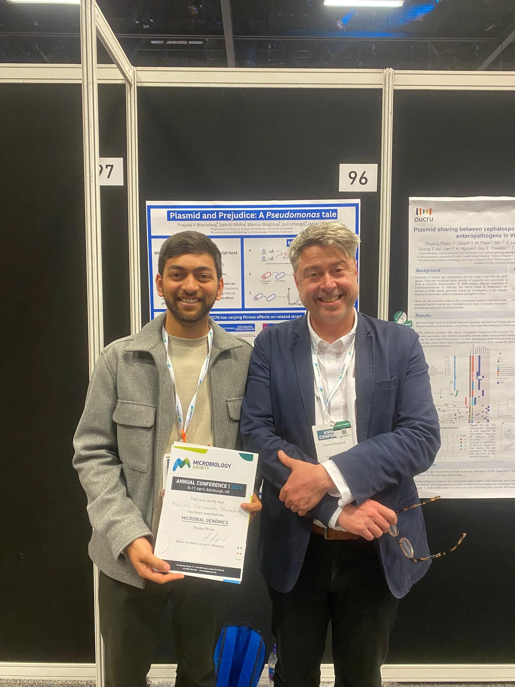

<figure>
    
    <figcaption><i>The wonderful people at the ELM Lab. Edinburgh 2024</i></figcaption>
</figure>

# Plasmid Host Interactions in *Pseudomonas aeruginosa*
The growing threat of Antimicrobial Resistance (AMR) is predicted to cause the death of 10 million people annually by 2050. The remarkable ability of bacteria to rapidly acquire resistance to antibiotics is a major challenge for healthcare professionals and the pharmaceutical industry. Even when it is possible to treat infections caused by multi-drug resistant pathogens, it can be difficult and expensive, and there is a dearth of new antimicrobials coming to market owing to rapid emergence of resistance in the face of prolonged development and testing. Preventing the emergence of AMR in potential pathogens is therefore an important goal for evolutionary microbiology. 

Mobile genetic elements (MGEs) such as plasmids and transposable elements are key driving forces that transmit AMR within bacterial communities. While plasmids are expected to be lost when there is low or no selection pressures, plasmids containing AMR genes are known to persist in environments with low, or even no, antibiotic selection pressure (low antibiotic concentration). It is thought that the ability of AMR plasmids to persist in communities is due to the presence of bacteria that can act as reservoirs for plasmids, because different bacteria vary in their susceptibility to acquiring, harbouring, and disseminating resistance MGEs. However, the features of bacteria that predispose them to become plasmid reservoirs is unclear, hampering our ability to predict such behaviour and develop therapeutic treatments to efficiently tackle AMR.

I will be working on studying the susceptibility of bacteria towards MGEs, and asking: what genetic and molecular factors stabilise plasmids in the host? What causes the ability to differentially acquire plasmids? And what evolutionary forces stabilise these interactions? My project will focus on the interactions between diverse strains of the opportunistic pathogen Pseudomonas aeruginosa, and their associated MGEs. I will be combining wet-lab experiments with Machine Learning and Bioinformatics tools to study plasmid dynamics as a function of the genetic interaction between the plasmid and the host genome. This work will help identify the underlying mechanisms that allow plasmids to persist and transfer among members of bacterial communities. Ultimately, we will be able to predict microbiomes in which transmission of AMR plasmids are likely to be heightened, allowing us to better control the spread of antimicrobial resistance.

<figure>
    
    <figcaption><i>Poster Prize in microbial genetics at Microbiology Society's Annual Conference. Edinburgh 2024</i></figcaption>
</figure>
